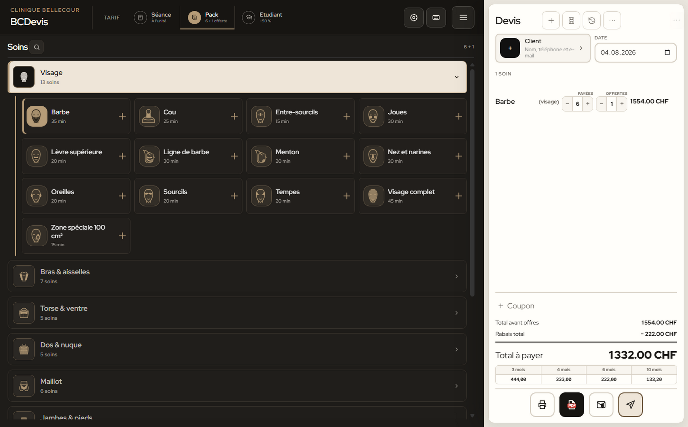
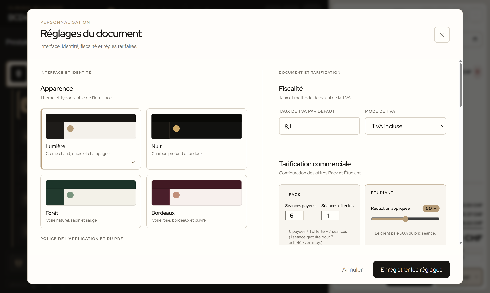
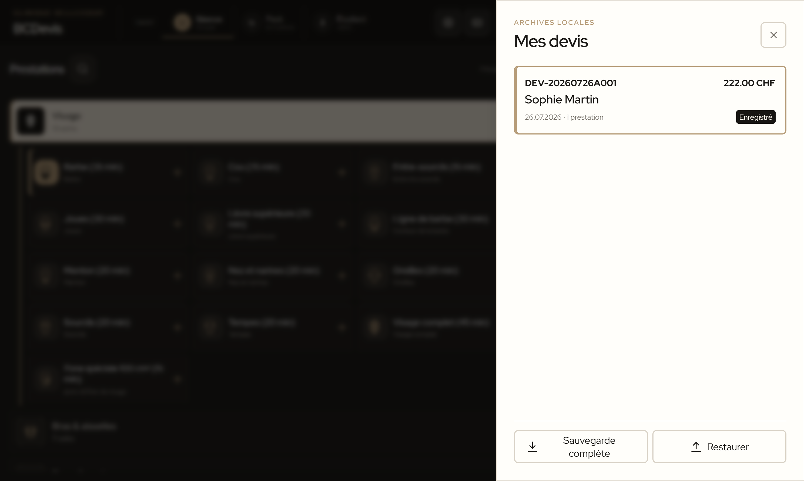

  
CLINIQUE BELLECOUR

  <h1>Mode d’emploi BCDevis</h1>
  
Guide utilisateur de l’application portable de création de devis.

  
Version 4.20.2 · Guide utilisateur

## À retenir

BCDevis fonctionne localement, sans compte, sans serveur et sans connexion Internet. Les devis, réglages et prestations personnalisées restent enregistrés sur l’ordinateur utilisé.

Pour commencer, lancez `BCDevis-4.20.2.exe`. Au premier démarrage, l’application crée un dossier `data` à côté de l’EXE. Ce dossier contient les données locales : il doit rester avec l’EXE.

## 1. Se repérer dans l’application

L’écran est organisé en deux zones :

- **Prestations** à gauche : familles de soins, recherche et ajout de prestations ;
- **Caisse** à droite : client, date, lignes du devis, réductions, TVA, total et actions de sortie.

Dans la barre supérieure :

- **Séance** : tarif à l’unité ;
- **Pack** : offre configurée dans les réglages, `6 + 1 offerte` par défaut ;
- **Étudiant** : réduction configurée à `50 %` par défaut ;
- **Nouveau** : créer un devis ;
- **Devis** : ouvrir l’historique local ;
- **Réglages** : personnaliser l’application et les documents ;
- **Aide** : afficher les raccourcis clavier.

Sur un écran étroit, les onglets **Prestations** et **Caisse** en bas permettent de passer d’une zone à l’autre. Le bouton **Caisse plein écran** permet d’agrandir temporairement la caisse.

## 2. Créer un devis

### Étape 1 : Choisir le tarif

Sélectionnez **Séance**, **Pack** ou **Étudiant** avant d’ajouter les prestations.

- En mode **Séance**, chaque ajout correspond à une séance facturée.
- En mode **Pack**, chaque nouvelle ligne utilise les quantités configurées dans les réglages. Par défaut, le pack contient six séances payées et une séance offerte.
- En mode **Étudiant**, la réduction est appliquée aux prestations et apparaît séparément dans les totaux.

Si le devis contient déjà des prestations, changer de tarif affiche une confirmation. Le nouveau tarif est appliqué à l’ensemble du devis ; les modes ne sont pas mélangés sur un même devis.

### Étape 2 : Ajouter les prestations

1. Ouvrez une famille, par exemple **Visage**, **Bras & aisselles**, **Maillot**, **Jambes & pieds**, **Électrolyse**, **Médecine esthétique** ou **Zones combinées**.
2. Cliquez sur le soin souhaité. Il est ajouté immédiatement à la caisse.
3. Répétez l’opération pour chaque soin.

Pour retrouver rapidement un soin, cliquez sur l’icône de recherche dans l’en-tête **Prestations**, puis saisissez son nom. Les prix sont masqués sur les boutons par défaut ; **Prix sur les boutons** permet de les afficher.

### Étape 3 : Ajouter un objet sur mesure

Utilisez **Objet sur mesure** en bas de la colonne Prestations pour créer une prestation libre. Renseignez :

- le nom de la prestation ;
- le prix unitaire en CHF ;
- la durée en minutes ;
- la catégorie ;
- l’option **Conserver dans le catalogue** si cette prestation doit être réutilisable dans les prochains devis.

Cliquez sur **Ajouter à la caisse**.

### Étape 4 : Renseigner le client

Dans la caisse, cliquez sur **Ajouter un client**. Les champs disponibles sont : nom complet, téléphone, e-mail et adresse. Cliquez sur **Valider le client** pour reprendre ces informations dans le devis.

La fiche client peut être rouverte à tout moment pour corriger les coordonnées. **Effacer** supprime les coordonnées du devis en cours.

### Étape 5 : Vérifier la date

La date du devis est celle du jour par défaut. Elle peut être choisie jusqu’à 14 jours à l’avance. La date de validité est calculée automatiquement à 30 jours calendaires et apparaît dans le document final.

## 3. Ajuster la caisse

Chaque ligne affiche le nom, la catégorie, la quantité, le prix et un bouton de suppression.

- Cliquez sur le nombre de séances pour diminuer la quantité.
- Faites un clic droit sur le nombre pour l’augmenter.
- Les flèches du clavier permettent également d’augmenter ou de diminuer la quantité lorsque le contrôle est sélectionné.
- Le nom d’une ligne peut être corrigé directement dans la caisse.
- Le bouton corbeille retire la ligne.

En mode Séance, lorsque la quantité atteint le seuil du pack configuré, le bouton **Ajouter 1 offerte** apparaît. Cliquez dessus pour transformer la ligne en pack ; les séances offertes sont visibles dans le devis mais ne sont jamais facturées.

### Coupon

Cliquez sur le bouton `+` de la ligne Coupon, puis saisissez le code et la valeur de la réduction.

- `%` applique une réduction en pourcentage ;
- `CHF` applique une réduction fixe.

Avec le tarif Étudiant, seul un coupon en CHF peut être ajouté : le coupon en pourcentage n’est pas cumulable avec le rabais étudiant.

### TVA

Le bouton **Afficher TVA** active ou masque les lignes fiscales du devis en cours. Le taux par défaut est de 8,1 % et le mode par défaut est **TVA incluse**. Le taux et le mode peuvent être modifiés dans **Réglages**.

### Paiement échelonné

Ouvrez **Paiement échelonné (CHF)** pour afficher une simulation indicative. Les options sont proposées selon le total : 3, 4 et 6 mois sous 1’000 CHF ; 10 mois à partir de 1’000 CHF ; 12 mois à partir de 2’000 CHF. Ces montants restent indicatifs et soumis à l’accord du partenaire financier.

## 4. Enregistrer, imprimer et transmettre

Les boutons d’action se trouvent en bas de la caisse.

- **Enregistrer** : archive le devis dans **Devis > Mes devis**. Les modifications sont aussi sauvegardées localement en arrière-plan.
- **Imprimer** : enregistre le devis puis ouvre la fenêtre d’impression Windows.
- **Télécharger le PDF** : enregistre directement un PDF A4 dans le dossier Windows **Téléchargements**. Un nouveau téléchargement ne remplace pas le précédent : un suffixe numérique est ajouté au nom si nécessaire.
- **WhatsApp** : génère le PDF et ouvre le partage natif avec le document joint lorsque celui-ci est disponible. Sinon, le PDF est créé et WhatsApp est ouvert avec un message prérempli.

Le PDF reprend le détail des prestations, les quantités payées et offertes, les réductions, la TVA, le total, les modalités de paiement, la date de validité et les mentions configurées.

Le bouton `…` en haut de la caisse donne accès à **Dupliquer le devis**, **Exporter ce devis**, **Importer un devis** et **Vider la caisse**.

## 5. Consulter l’historique et sauvegarder les données

Cliquez sur **Devis** dans la barre supérieure pour ouvrir **Mes devis**. Chaque carte affiche le numéro, le client, la date, le nombre de prestations et le total. Cliquez sur une carte pour rouvrir le devis.

En bas de l’historique :

- **Sauvegarde complète** exporte les réglages, l’historique, le brouillon et les prestations personnalisées dans un fichier JSON ;
- **Restaurer** importe une sauvegarde JSON complète.

La restauration remplace les données locales actuelles après confirmation. Faites une sauvegarde complète avant de transférer l’application vers un autre ordinateur.

Pour déplacer BCDevis, copiez **l’EXE et le dossier `data`** ensemble. Une sauvegarde complète constitue la méthode recommandée pour transférer uniquement les données.

## 6. Personnaliser l’application

Ouvrez **Réglages**, puis cliquez sur **Enregistrer les réglages** après toute modification.

Les sections disponibles sont :

- **Apparence** : thèmes Lumière, Nuit ou Forêt ;
- **Votre entreprise** : nom, sous-titre, adresse, téléphone, e-mail et UID / TVA ;
- **Logo de l’application** : logo affiché dans l’interface ;
- **Logo du PDF** : logo utilisé dans les documents imprimés. S’il est vide, le logo de l’application est réutilisé ;
- **Numérotation des devis** : préfixe et nom de machine. Le format par défaut ressemble à `DEV-20260718A001` ;
- **Fiscalité** : taux de TVA et choix TVA incluse ou TVA en plus ;
- **Tarification commerciale** : nombre de séances payées et offertes du pack, ainsi que le pourcentage étudiant ;
- **Familles de prestations** : familles visibles dans le catalogue ;
- **Mentions légales** : conditions de paiement, conditions du tarif étudiant et note de bas de page.

Les logos acceptés sont PNG, JPG et WebP, jusqu’à 4 Mo. Un PNG transparent est recommandé. Les logos sont optimisés puis conservés uniquement dans les données locales.

## 7. Raccourcis clavier

| Raccourci | Action |
| --- | --- |
| `Ctrl` + `N` | Nouveau devis |
| `Ctrl` + `S` | Enregistrer le devis |
| `Ctrl` + `K` ou `/` | Rechercher une prestation |
| `Ctrl` + `P` | Imprimer le devis |
| `Ctrl` + `Maj` + `S` | Créer le PDF |
| `Ctrl` + `,` | Ouvrir les réglages |
| `Échap` | Fermer une fenêtre ou la recherche |

Sur Mac, remplacez `Ctrl` par `⌘`.

## 8. Résoudre les situations courantes

**Le devis n’apparaît pas dans Mes devis.**

Cliquez sur **Enregistrer**. Un brouillon peut être conservé localement sans apparaître dans l’historique tant qu’il n’a pas été enregistré.

**Le PDF n’est pas visible.**

Ouvrez le dossier Windows **Téléchargements**. Si un fichier du même nom existe déjà, BCDevis crée automatiquement une nouvelle version numérotée.

**J’ai changé de tarif par erreur.**

Si la confirmation est encore ouverte, cliquez sur **Annuler**. Sinon, rechargez une version enregistrée depuis l’historique ou créez un nouveau devis. Le changement de tarif est appliqué à toutes les lignes après confirmation.

**Je change d’ordinateur.**

Depuis **Devis**, cliquez sur **Sauvegarde complète**, copiez le fichier JSON sur le nouvel ordinateur, puis utilisez **Restaurer**. Conservez également l’EXE à jour.

**Les données semblent avoir disparu.**

Vérifiez que l’EXE a été déplacé avec son dossier `data`. L’application ne stocke pas les données dans un compte en ligne ; un autre dossier `data` correspond à un autre profil local.
