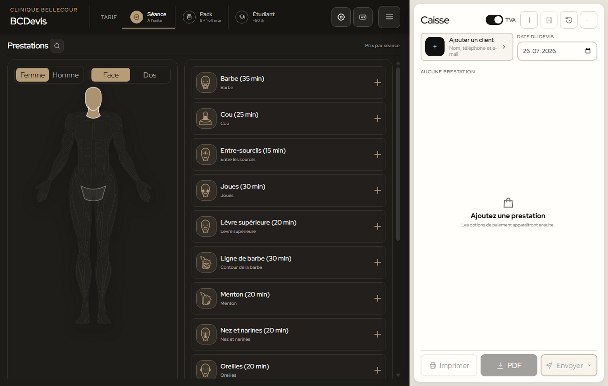

  
CLINIQUE BELLECOUR

  <h1>Mode d’emploi BCDevis</h1>
  
Guide utilisateur de l’application de création de devis, locale ou centralisée.

  
Version 7.1.3 - Windows - Linux - macOS - ChromeOS - iPadOS

## À retenir

BCDevis fonctionne localement par défaut, sans compte ni serveur. La V7 permet aussi de relier plusieurs postes à une base PostgreSQL centrale depuis **Réglages > Données**. Dans les deux modes, l’application et les devis restent utilisables hors ligne ; la synchronisation reprend au retour du réseau.

- **Windows** : lancez `BCDevis-7.1.3.exe`. Le dossier `data` créé à côté de l’EXE doit rester avec celui-ci.
- **Linux** : rendez `BCDevis-7.1.3-linux-x86_64.AppImage` exécutable, puis ouvrez-le. Les données sont conservées dans le profil local de l’utilisateur.
- **macOS** : ouvrez `BCDevis-7.1.3-mac.dmg`, puis glissez BCDevis dans Applications. Les données sont conservées dans le profil de l’utilisateur.
- **ChromeOS** : ouvrez l’adresse HTTPS fournie, puis choisissez **Installer la page en tant qu’application** dans le menu Chrome. Les données sont conservées dans le profil Chrome.
- **iPadOS** : ouvrez la même adresse HTTPS dans Safari, puis choisissez **Partager > Sur l’écran d’accueil**. Les données sont conservées localement sur l’iPad.

Le livrable client contient également une fiche **Utilisation rapide**, la fiche **Raccourcis clavier V7** et un **modèle de devis** importable.

### Fonctions récentes à connaître

- **Suivi commercial des devis** : activez-le dans **Réglages > Devis > Suivi des devis** pour utiliser les statuts, les filtres, la chronologie, les notes, les prochaines relances, les compteurs et les rappels au démarrage.
- **Workflow contrôlé et V2** : les statuts suivent un ordre précis ; un devis accepté, refusé, expiré ou facturé est verrouillé et peut être repris dans une nouvelle version liée.
- **Affichage Auto, Mobile ou Bureau** : ouvrez le menu **Catalogue**, puis choisissez la vue adaptée à votre écran. Le choix reste mémorisé uniquement sur ce poste.
- **Confort iPad et Smartphone** : les actions tactiles sont agrandies ; un balayage vers la gauche révèle la suppression et **Annuler** restaure immédiatement la dernière ligne retirée.
- **Catalogue personnalisable** : l’éditeur des tuiles permet de rechercher un soin, prévisualiser et enregistrer son nom, son pictogramme, sa durée ou son tarif.
- **Travail multi-postes facultatif** : PostgreSQL synchronise les devis, leur suivi et les réglages métier, réserve des numéros uniques et permet de continuer hors ligne.
- **Documents partagés et Factures partagées** : après connexion au serveur central, deux pictogrammes distincts donnent accès aux documents généraux et aux factures envoyées, avec import, aperçu, téléchargement et impression.

Mode Tuiles : les soins sont regroupés dans des familles dépliables.

## 1. Se repérer dans l’application

L’écran est organisé en deux zones :

- **Soins** à gauche : familles, recherche et ajout ;
- **Devis** à droite : client, date, lignes, réductions, TVA, total et sorties.

Dans la barre supérieure :

- **Séance** : tarif à l’unité ;
- **Pack** : offre configurée dans les réglages, `6 + 1 offerte` par défaut ;
- **Étudiant** : réduction configurée à `50 %` par défaut ;
- **Réglages** et **Raccourcis** : toujours disponibles après les tarifs ; **Documents partagés** et **Factures partagées** s’ajoutent uniquement lorsque le poste est connecté au serveur central ;
- **Catalogue** : **Sur mesure**, affichage des prix et choix de la vue **Auto / Mobile / Bureau**.

Dans l’en-tête du devis, les boutons donnent directement accès au nouveau devis, à l’enregistrement, à l’historique et au menu `…`.

Sur un écran étroit, les onglets **Soins** et **Devis** en bas permettent de passer d’une zone à l’autre. Sur ordinateur, le devis occupe toute la hauteur de la fenêtre.

### Choisir la vue Auto, Mobile ou Bureau

Ouvrez le menu **Catalogue** avec le bouton à trois lignes, puis utilisez la zone **Vue** :

- **Auto** adapte automatiquement l’application à la largeur disponible : Bureau au-delà de 600 px et Mobile jusqu’à 600 px ;
- **Mobile** force une surface étroite centrée, de grandes cibles tactiles et les onglets **Soins / Devis**, même sur un grand écran ;
- **Bureau** force l’interface complète avec les deux zones visibles lorsque la fenêtre offre assez de place.

Le choix est enregistré localement. Il ne modifie ni les devis, ni les PDF, ni l’affichage des autres postes reliés à PostgreSQL.

## 2. Créer un devis

### Étape 1 : Choisir le tarif

Sélectionnez **Séance**, **Pack** ou **Étudiant** avant d’ajouter les soins.

- En mode **Séance**, chaque ajout correspond à une séance facturée.
- En mode **Pack**, chaque nouvelle ligne utilise les quantités configurées dans les réglages. Par défaut, le pack contient six séances payées et une séance offerte.
- En mode **Étudiant**, la réduction est appliquée aux soins et apparaît séparément dans les totaux.

Si le devis contient déjà des soins, changer de tarif affiche une confirmation. Le nouveau tarif est appliqué à l’ensemble du devis ; les modes ne sont pas mélangés sur un même devis.

### Étape 2 : Choisir Tuiles ou Mannequin

BCDevis propose deux façons de parcourir les mêmes soins. Le choix modifie uniquement la navigation : il ne change ni les tarifs, ni le devis.

Pour sélectionner le mode :

1. ouvrez **Réglages** avec la roue dentée ;
2. restez dans l’onglet **Interface** ;
3. dans **Navigation**, choisissez **Tuiles** ou **Corps interactif** ;
4. cliquez sur **Enregistrer**.

Le mode choisi est mémorisé pour les prochains lancements. **Tuiles** reste le mode activé par défaut lors d’une première utilisation.

Réglages > Interface : choix de la navigation, du thème, de la police, du confort iPad et du lancement automatique.

#### Confort iPad

Dans **Réglages > Interface > iPad**, trois choix sont disponibles :

- **Automatique** - valeur par défaut des nouveaux profils - reconnaît iPadOS et adapte les zones tactiles, les champs, les marges sûres et le clavier virtuel ;
- **Toujours** force ce confort tactile si Safari ou un navigateur intégré n’est pas reconnu ;
- **Désactivée** conserve uniquement le responsive standard.

Le choix est mémorisé. En portrait, les soins utilisent deux colonnes ; en paysage, ils exploitent davantage la largeur ; en Split View, ils repassent sur une colonne. La navigation **Soins / Devis** reste toujours accessible en bas. Cette optimisation ne modifie ni les prix, ni les données, ni le PDF A4.

#### Mode Tuiles

Ouvrez une famille, par exemple **Visage**, **Bras & aisselles**, **Maillot**, **Jambes & pieds**, **Électrolyse**, **Médecine esthétique** ou **Zones combinées**. Les soins apparaissent sous la tuile ; cliquez sur le `+` du soin souhaité pour l’ajouter au devis.

La famille **Zones combinées** propose quatorze associations tarifées. En mode **Séance**, le catalogue affiche le prix d’une séance. Avec le **Pack 6 + 1**, il affiche le prix moyen par session communiqué pour ce pack ; le devis conserve le détail exact de six séances payées et d’une séance offerte.

Pour adapter une tuile, ouvrez **Réglages > Interface > Catalogue > Éditeur des tuiles**. Recherchez le soin ou filtrez par catégorie, puis modifiez son pictogramme SVG, son nom, son temps ou son prix : l’aperçu placé au-dessus des champs se met à jour immédiatement. Le filtre **Modifiées** retrouve les personnalisations enregistrées et celles en cours. Cliquez ensuite sur **Enregistrer** ; l’éditeur vous prévient si vous tentez de le fermer avant cette étape. Ces personnalisations restent locales, sont incluses dans la sauvegarde complète et s’appliquent aux prochains ajouts ; elles ne réécrivent pas les lignes déjà présentes dans un devis. **Réinitialiser** prépare le retour d’une tuile à sa valeur d’origine, tandis que **Tout réinitialiser** le prépare pour tout le catalogue ; validez ensuite avec **Enregistrer**.

#### Mode Mannequin - Corps interactif

Le bouton **Corps interactif** active le mannequin anatomique :

1. choisissez **Femme** ou **Homme** ;
2. choisissez **Face** ou **Dos** ;
3. cliquez sur une zone du mannequin ;
4. sélectionnez le soin proposé à droite pour l’ajouter au devis.

La zone sélectionnée est mise en évidence. Sur la face avant, le mannequin donne accès au visage, au torse, aux bras, au maillot et aux jambes. Sur la vue arrière, il donne accès au cuir chevelu, au dos, aux bras, aux fesses et jambes ainsi qu’au **SIF**.

Mode Mannequin : Femme/Homme et Face/Dos restent accessibles au-dessus de la silhouette.

En sélectionnant le visage, BCDevis ouvre un schéma plus précis avec douze zones : visage complet, tempes, sourcils, entre-sourcils, nez et narines, joues, lèvre supérieure, barbe, ligne de barbe, menton, oreilles et cou. Utilisez **Corps complet** pour revenir au mannequin.

Les filtres évitent les mélanges : les **fesses** et le **SIF** se sélectionnent uniquement à l’arrière, le maillot avant n’affiche pas le SIF et **Cuir chevelu** propose uniquement la mésothérapie capillaire. Les familles **Consultations**, **Électrolyse**, **Médecine esthétique** et **Zones combinées** restent disponibles sous le mannequin. Les 87 soins actifs restent donc accessibles dans les deux modes.

Pour changer de morphologie, utilisez les boutons **Femme** et **Homme**. L’espace libre autour du mannequin reste neutre afin d’éviter tout changement involontaire.

Au clavier, utilisez `Tab` pour atteindre les boutons ou une zone, puis `Entrée` ou `Espace` pour l’activer.

Dans les deux modes, la loupe recherche un soin dans tout le catalogue. Les prix sont masqués sur les boutons par défaut ; utilisez **Catalogue > Prix** ou `Alt + P` pour les afficher.

### Étape 3 : Sur mesure

Utilisez **Catalogue > Sur mesure**, puis renseignez :

- le nom ;
- le prix unitaire en CHF ;
- la durée en minutes ;
- la catégorie ;
- l’option **Conserver** si ce soin doit être réutilisable dans les prochains devis.

Cliquez sur **Ajouter**.

### Étape 4 : Renseigner le client

Dans **Devis**, cliquez sur le pictogramme client. Recherchez un contact existant ou créez-en un. Le formulaire affiche d’abord le nom, le téléphone et l’e-mail ; **Plus d’informations** ouvre la société, l’adresse complète, la date de naissance, la langue, la référence interne et les notes. Cliquez sur **Enregistrer et utiliser**.

Le répertoire accepte les imports CSV, vCard (`.vcf`) et JSON, et propose les trois formats en export. Les doublons sont fusionnés par e-mail, téléphone, puis nom et adresse. **Retirer du devis** enlève le destinataire sans supprimer le contact ; la corbeille supprime le contact du répertoire. Chaque devis conserve une copie de ses coordonnées : modifier le contact plus tard ne réécrit pas les devis déjà enregistrés.

### Étape 5 : Vérifier la date

La date du devis est celle du jour par défaut. Elle peut être choisie jusqu’à 14 jours à l’avance. La date de validité est calculée automatiquement à 30 jours calendaires et apparaît dans le document final.

## 3. Ajuster le devis

Chaque ligne affiche le nom, la catégorie, la quantité et le prix. La suppression reste volontairement masquée afin de laisser toute la largeur aux quantités.

- Cliquez sur **−** pour diminuer la quantité et sur **+** pour l’augmenter.
- Dans un pack, les séances payées et offertes disposent chacune de leurs propres boutons **−** et **+**.
- Le bouton **−** devient indisponible lorsque la quantité minimale est atteinte.
- Le nom d’une ligne peut être corrigé directement dans le devis.
- Avec une souris, allez jusqu’au bord droit de la ligne pour faire apparaître la corbeille.
- En mode iPad ou Smartphone, une indication présente le geste lors de la première utilisation : balayez la ligne vers la gauche, puis touchez la corbeille pour confirmer la suppression.
- Après une suppression tactile, utilisez **Annuler** dans la notification pendant quelques secondes pour restaurer la ligne.
- Appuyez sur `Échap` ou touchez de nouveau la ligne pour refermer l’action sans supprimer.

En mode Séance, lorsque la quantité atteint le seuil du pack configuré, le bouton **+1 offerte** apparaît. Cliquez dessus pour transformer la ligne en pack ; les séances offertes ne sont jamais facturées.

### Coupon

Cliquez sur **Coupon**, puis saisissez le code et la valeur de la réduction.

- `%` applique une réduction en pourcentage ;
- `CHF` applique une réduction fixe.

Avec le tarif Étudiant, seul un coupon en CHF peut être ajouté : le coupon en pourcentage n’est pas cumulable avec le rabais étudiant.

### TVA

Le bouton **TVA** active ou masque les lignes fiscales du devis en cours. Le taux par défaut est de 8,1 % et le mode par défaut est **TVA incluse**. Le taux et le mode peuvent être modifiés dans **Réglages**.

### Paiement échelonné

La simulation indicative apparaît automatiquement sous le total. Les options sont proposées selon le montant : 3, 4 et 6 mois sous 1’000 CHF ; 10 mois à partir de 1’000 CHF ; 12 mois à partir de 2’000 CHF. Ces montants restent indicatifs et soumis à l’accord du partenaire financier.

## 4. Enregistrer, imprimer et envoyer

Quatre sorties restent visibles au bas du devis sous forme d’icônes : imprimante, PDF, e-mail direct et envois avec PDF à joindre. Leur nom complet apparaît au survol ou au focus ; leur libellé reste disponible pour les aides techniques. L’enregistrement se trouve dans l’en-tête. Deux indicateurs distincts évitent toute ambiguïté : l’archivage affiche **Non archivé**, **Enregistré** ou **À enregistrer** ; le suivi affiche **Brouillon**, **Prêt à envoyer**, **Envoyé**, etc.

- **Ajouter un client** : ouvre les coordonnées du destinataire. Sur un devis verrouillé, le bouton reste actif pour expliquer qu’une nouvelle version est nécessaire, sans modifier le devis accepté, refusé ou expiré.
- **Enregistrer** : archive le devis dans **Mes devis**, accessible avec le bouton **Historique**. Les modifications sont aussi sauvegardées localement en arrière-plan.
- **Non archivé** signifie que le devis courant est conservé localement mais n’existe pas encore dans **Mes devis** ; **À enregistrer** signale qu’une version archivée a changé ; **Enregistré** confirme que la version affichée est à jour dans l’historique.
- **Imprimer** : enregistre le devis puis ouvre la fenêtre d’impression du système.
- **Télécharger le PDF** : sous Windows, Linux et macOS, enregistre directement un PDF A4 dans le dossier choisi dans **Réglages > Entreprise > Fichiers PDF** ; **Téléchargements** reste le dossier par défaut. Sous ChromeOS et dans la PWA, le navigateur choisit l’emplacement via **Enregistrer au format PDF**. Le document reste sur fond blanc, quel que soit le thème utilisé dans l’application.
- **E-mail** ouvre directement dans l’application de bureau un nouveau message avec l’objet, le texte et le PDF déjà joint. L’adresse du client est utilisée lorsqu’elle existe.
- **À joindre** regroupe les deux choix manuels :
  - **WhatsApp** prépare le PDF dans le dossier configuré, puis ouvre WhatsApp avec le message prérempli ;
  - **Outlook** crée le PDF dans le dossier configuré, puis ouvre Outlook Web avec le destinataire, l’objet et le texte préremplis. Joignez ensuite le PDF téléchargé.

Sous Windows, **Application e-mail** utilise Outlook classique lorsqu’il est disponible. Sinon, comme sur macOS et Linux, un brouillon `.eml` contenant déjà le message et le PDF est créé dans **Téléchargements**, puis ouvert avec la messagerie par défaut. Le PDF joint peut se trouver dans le dossier configuré. **Outlook Web** ouvre directement la composition Microsoft 365, mais le navigateur impose de sélectionner manuellement ce PDF dans le dossier configuré. Aucun message `mailto:` sans pièce jointe n’est ouvert. WhatsApp exige également l’ajout manuel du PDF. Sous ChromeOS, créez d’abord le PDF avec la commande **PDF**, puis joignez-le depuis votre messagerie.

Le PDF reprend le détail des soins, les quantités payées et offertes, les réductions, la TVA, le total, les modalités de paiement, la date de validité et les mentions configurées.

Le bouton `…` en haut du devis donne accès à **Dupliquer**, **Exporter**, **Importer** et **Vider**.

## 5. Consulter l’historique et sauvegarder les données

Cliquez sur **Historique** dans l’en-tête du devis pour ouvrir **Mes devis**. Chaque carte affiche le numéro, le client, la date, le nombre de soins et le total. Cliquez sur une carte pour rouvrir le devis.

Le suivi commercial est facultatif. Pour l’activer, ouvrez **Réglages > Devis > Suivi des devis**, activez l’option, puis choisissez la validité par défaut, le délai de relance, les rappels au démarrage et l’affichage des compteurs. Enregistrez ensuite les réglages.

Depuis **Mes devis**, ouvrez l’onglet **Suivi**, puis utilisez le triangle d’une carte pour faire progresser le devis dans son parcours : **Brouillon** → **Prêt à envoyer** → **Envoyé** → **Accepté**, **Refusé** ou **Expiré**. Les retours incohérents sont refusés. Vous pouvez ajouter une note interne et fixer la prochaine relance sans modifier le PDF remis au client. Lorsqu’il est actif :

- l’onglet **Historique** conserve une liste compacte des devis et affiche uniquement leur dernier statut commercial lorsque le suivi est actif, sans tag « Enregistré » ni outils commerciaux ;
- l’onglet **Suivi** regroupe les statuts, couleurs, filtres, relances, chronologies et actions commerciales des devis actifs ;
- avec une souris, le bouton du détail apparaît au survol ou au focus ; sur écran tactile, touchez directement la fiche pour ouvrir ou refermer le détail ;
- dans le détail, **Ouvrir le devis** charge le devis dans la caisse ;
- l’onglet **Suivi** filtre les devis brouillons, prêts à envoyer, envoyés, à relancer, acceptés, refusés ou expirés ;
- le triangle d’une carte ouvre la chronologie complète, la prochaine relance et la zone de note interne ;
- **À relancer** reste un indicateur orange calculé à partir de la date de relance, tandis que le dernier statut commercial demeure **Envoyé** ;
- les compteurs résument les statuts et les relances dans la fenêtre **Mes devis** ;
- les rappels au démarrage signalent les devis arrivés à leur date de relance ;
- après la préparation d’un e-mail, d’un message WhatsApp ou d’Outlook Web, BCDevis demande si le devis doit être marqué comme envoyé ;
- les nouveaux événements indiquent l’utilisateur et le poste disponibles ;
- un devis accepté, refusé ou expiré devient non modifiable ; utilisez **Créer une V2** pour poursuivre sans écraser la version précédente ;
- sur un devis accepté, **Importer la facture envoyée** archive le PDF sous un nom lié au devis, puis fait passer le devis à **Facture envoyée** : il quitte l’onglet **Suivi** et la facture apparaît dans **Factures**. Le statut seul ne fabrique jamais une facture.

La désactivation du suivi masque les onglets, les couleurs et les rappels sans supprimer la chronologie enregistrée. Les couleurs sont toujours accompagnées du nom du statut.

En bas de l’historique :

- **Sauvegarde complète** exporte les réglages, l’historique, le brouillon et les soins personnalisés dans un fichier JSON ;
- **Restaurer** importe une sauvegarde JSON complète.

Historique local : réouverture d’un devis, sauvegarde complète et restauration.

La restauration remplace les données locales actuelles après confirmation. Faites une sauvegarde complète avant de transférer l’application vers un autre ordinateur.

Pour déplacer BCDevis sous Windows, copiez **l’EXE et le dossier `data`** ensemble. Pour changer d’ordinateur, de poste Linux, de Mac, de Chromebook ou de plateforme, utilisez toujours la sauvegarde complète JSON.

## 6. Personnaliser l’application

Ouvrez **Réglages**, choisissez l’onglet concerné, puis cliquez sur **Enregistrer les réglages** après toute modification.

Les cinq onglets disponibles sont :

- **Interface** : thèmes Lumière, Nuit, Forêt ou Bordeaux ; polices Red Hat Display, Roboto, Roboto Slab ou Système ; navigation **Tuiles / Corps interactif** ; familles visibles dans le catalogue ; option **Lancer au démarrage** pour Windows, Linux et macOS ;
- **Entreprise** : nom, sous-titre, adresse, téléphone, e-mail, UID / TVA, logo principal, logo du PDF, préfixes des devis et factures, code poste commun et dossier local des devis PDF. Si le logo PDF est vide, le logo principal est réutilisé ;
- **Tarifs** : taux et mode de TVA, nombre de séances payées et offertes du pack, ainsi que le pourcentage étudiant ;
- **Devis** : conditions de paiement, conditions du tarif étudiant, zones de signature, note de bas de page, suivi commercial facultatif, validité et délai de relance ;
- **Données** : assistant de changement d’adresse du site, activation du mode centralisé, adresse HTTPS de l’API BCDevis, compte, nom de l’appareil, numéros uniques facultatifs, test PostgreSQL, connexion, synchronisation et résolution des conflits.

Le format de numéro par défaut ressemble à `DEV-20260806A001`. Une facture importée pour ce devis est archivée sous `FAC-20260806A001.pdf` : seul le préfixe change, le code poste `A` et la séquence restent identiques. Le choix du dossier PDF est appliqué immédiatement et reste local à l’ordinateur. L’option **Lancer au démarrage** agit sur la session de l’ordinateur et n’est disponible que dans l’application de bureau empaquetée.

Les logos acceptés sont PNG, JPG et WebP, jusqu’à 4 Mo. Un PNG transparent est recommandé. Les logos sont optimisés avant leur enregistrement. En mode centralisé, les réglages métier et les personnalisations du catalogue sont partagés ; le thème, la police, l’affichage et les préférences propres au poste restent locaux.

## 7. Relier plusieurs postes à PostgreSQL

Le serveur BCDevis Central doit d’abord être déployé par l’administrateur sur une adresse HTTPS. PostgreSQL n’est jamais ouvert directement aux postes : l’application dialogue avec l’API sécurisée, tandis que l’hôte SQL, le port, l’utilisateur et le mot de passe restent uniquement sur le serveur.

Pour connecter un poste :

1. ouvrez **Réglages > Données** et activez **Connecter ce poste** ;
2. saisissez l’adresse HTTPS de l’API, par exemple `https://devis.clinique.example` ;
3. indiquez l’e-mail du compte, son mot de passe et un nom permettant d’identifier l’appareil ;
4. cliquez sur **Tester le serveur** : le résultat doit confirmer l’API V7 et **PostgreSQL prêt** ;
5. cliquez sur **Se connecter**.

Après la première connexion, le panneau affiche l’état en ligne ou hors ligne, le code unique du poste (`P01`, `P02`, etc.), la disponibilité de PostgreSQL, la révision centrale et l’heure de la dernière synchronisation. Le mot de passe du compte n’est pas conservé par BCDevis ; seule la session protégée est mémorisée sur le poste.

### Numéros uniques centralisés

Après la connexion, cochez **Numéros uniques centralisés**, puis enregistrez les réglages. PostgreSQL attribue alors une séquence commune à toute l’organisation, au format `DEV-YYYYMMDDC000001`. L’application réserve automatiquement plusieurs numéros à l’avance pour que les nouveaux devis puissent encore être créés pendant une coupure. Ces réservations empêchent les doublons entre postes ; elles peuvent créer des trous si un numéro réservé n’est finalement jamais utilisé.

Sont partagés entre les postes :

- les devis enregistrés et leur suivi commercial ;
- la numérotation et les compteurs de devis ;
- les données d’entreprise, tarifs, conditions, signatures et réglages métier ;
- les soins sur mesure conservés et les personnalisations du catalogue.

### Fenêtres Documents partagés et Factures partagées

Après connexion du poste au serveur central, les boutons **Documents partagés** et **Factures partagées** apparaissent dans la barre supérieure avec deux pictogrammes différents. Ils ouvrent deux vues de la même bibliothèque partagée. Sans serveur central, ces boutons restent masqués car les fichiers ne sont pas stockés localement. Vous pouvez :

- cliquer sur **Importer un PDF** pour charger un document de 8 Mo maximum ;
- rechercher par titre, nom de fichier, numéro de devis ou client ;
- sélectionner un document pour l’afficher directement dans BCDevis ;
- utiliser **Télécharger** pour en conserver une copie locale ;
- utiliser **Imprimer** pour lancer l’impression du PDF sélectionné.

Lors d’un import, le devis et le client actuellement ouverts sont associés au document pour faciliter la recherche. Une facture importée depuis un devis accepté est renommée avec le préfixe facture et la référence du devis, puis clôt son suivi actif seulement après la réussite de l’archivage. Par exemple, `DEV-20260806A001` donne `FAC-20260806A001.pdf` avec les réglages par défaut. Les PDF sont conservés dans PostgreSQL et ne sont chargés qu’à la demande par l’API sécurisée. La liste et l’aperçu exigent donc une connexion active ; ils ne font pas partie de la réserve hors ligne.

Le brouillon actuellement ouvert, le thème, la police, la navigation, le confort iPad, l’affichage des prix et le lancement automatique restent propres à chaque appareil.

### Travail hors ligne et conflits

Une coupure de réseau ne bloque pas la création d’un devis. Les changements sont enregistrés localement et remis en attente ; BCDevis tente automatiquement de les synchroniser lorsque la connexion revient. Le bouton **Synchroniser maintenant** permet de relancer l’opération manuellement.

### Changer l’adresse du site sans perdre les données

Le navigateur isole le stockage local de chaque domaine. Pour passer de l’ancienne adresse à `https://bcd.athys.ch/`, ouvrez **Réglages > Données > Changer l’adresse du site** sur l’ancien site, puis :

1. vérifiez l’adresse HTTPS et cliquez sur **Préparer le transfert** ;
2. après le téléchargement du JSON, cliquez sur **Ouvrir la nouvelle adresse** ;
3. sur la destination, utilisez **Importer ici**, puis contrôlez l’historique, les réglages et le brouillon avant de supprimer le fichier.

Le transfert reprend l’adresse de l’API, l’e-mail et le nom du poste, mais exclut le mot de passe, la session, les numéros réservés et l’identifiant technique. Une nouvelle authentification est donc demandée. BCDevis avertit également si le fichier visait un autre domaine.

Si deux postes modifient le même devis avant de se synchroniser, BCDevis ne choisit pas silencieusement. Le panneau **Conflit à résoudre** propose de conserver la version de ce poste ou celle du serveur. Une sauvegarde JSON complète est créée avant l’application du choix.

Pour revenir au fonctionnement strictement local, utilisez **Déconnecter ce poste** puis désactivez l’option. Les données déjà présentes sur l’appareil restent disponibles.

## 8. Raccourcis clavier V7

| Raccourci | Action |
| --- | --- |
| `Alt` + `M` | Ouvrir le menu Catalogue |
| `Ctrl` + `K` ou `/` | Rechercher |
| `Alt` + `P` | Afficher ou masquer les prix |
| `Ctrl` + `Maj` + `N` | Sur mesure |
| `Ctrl` + `N` | Nouveau devis |
| `Ctrl` + `S` | Enregistrer le devis |
| `Ctrl` + `H` | Ouvrir l’historique |
| `Ctrl` + `D` | Dupliquer |
| `Ctrl` + `O` | Importer |
| `Ctrl` + `E` | Exporter |
| `Ctrl` + `P` | Imprimer le devis |
| `Ctrl` + `Maj` + `S` | Créer le PDF |
| `Ctrl` + `Alt` + `W` | Préparer le devis via WhatsApp |
| `Ctrl` + `,` | Ouvrir les réglages |
| `?` | Ouvrir le centre d’aide sur les raccourcis |
| `Échap` | Fermer une fenêtre ou la recherche |

Sur Mac, remplacez `Ctrl` par `⌘`. Utilisez les flèches pour parcourir les tarifs, thèmes, onglets et menus. Le bouton **Aide** ouvre le centre HTML embarqué, qui devient la référence à jour et reste disponible hors ligne sans Internet ni PostgreSQL. Sa fonction **Imprimer** fournit au besoin une version papier ; le PDF séparé reste seulement un livrable de secours de la version 7.1.3.

## 9. Utiliser le modèle de devis

Le livrable contient `MODELE-DEVIS-V7.json`. Ce fichier ne contient ni date fixe ni numéro imposé.

1. Ouvrez le menu `...` dans l’en-tête du devis.
2. Cliquez sur **Importer**.
3. Sélectionnez `MODELE-DEVIS-V7.json`.
4. BCDevis crée un devis vierge avec la date, la numérotation et les réglages actuels.
5. Ajoutez le client et les soins, puis enregistrez.

Pour créer un modèle personnalisé, préparez un devis type puis utilisez `...` > **Exporter**. Ne confondez pas cette fonction avec **Restaurer**, qui remplace toute la base locale par une sauvegarde complète.

## 10. Résoudre les situations courantes

**Le devis n’apparaît pas dans Mes devis.**

Cliquez sur **Enregistrer**. Le brouillon en cours est conservé localement sans apparaître dans l’historique. Si vous créez un nouveau devis avant de l’enregistrer, BCDevis prévient que ce brouillon sera remplacé.

**Le PDF n’est pas visible.**

Sous Windows, Linux et macOS, vérifiez le chemin affiché dans **Réglages > Entreprise > Fichiers PDF** ; utilisez **Par défaut** pour revenir à **Téléchargements**. Sous ChromeOS, recommencez puis choisissez **Enregistrer au format PDF** dans l’impression. Un fichier existant n’est pas écrasé dans l’application de bureau.

**J’ai changé de tarif par erreur.**

Si la confirmation est encore ouverte, cliquez sur **Annuler**. Sinon, rechargez une version enregistrée depuis l’historique ou créez un nouveau devis. Le changement de tarif est appliqué à toutes les lignes après confirmation.

**Je ne vois pas le mannequin ou je souhaite revenir aux tuiles.**

Ouvrez **Réglages > Interface**, choisissez **Corps interactif** pour afficher le mannequin ou **Tuiles** pour retrouver les familles en accordéon, puis cliquez sur **Enregistrer**.

**Je change d’ordinateur.**

Depuis **Historique**, cliquez sur **Sauvegarde complète**, copiez le fichier JSON sur le nouvel appareil, puis utilisez **Restaurer**.

**Les données semblent avoir disparu.**

Sous Windows, vérifiez que l’EXE a été déplacé avec son dossier `data`. Sous Linux et macOS, vérifiez que vous utilisez le même compte local. Sous ChromeOS, vérifiez le profil Chrome actif. Si la centralisation est active, ouvrez **Réglages > Données** et contrôlez l’état de la session et la dernière synchronisation.

**La synchronisation ne démarre pas.**

Ouvrez **Réglages > Données**, vérifiez l’adresse HTTPS, puis cliquez sur **Tester le serveur**. La ligne Base de données doit indiquer **PostgreSQL prêt**. Si le serveur répond mais que la session a expiré, renseignez de nouveau le mot de passe et reconnectez le poste.

**Le lancement automatique ne s’active pas.** Dans la version empaquetée, ouvrez **Réglages > Interface**. Sous Windows, contrôlez aussi le démarrage dans les paramètres du système. Sous Linux, si l’AppImage a été déplacé, désactivez puis réactivez l’option.
